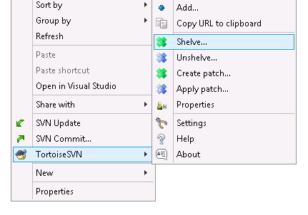
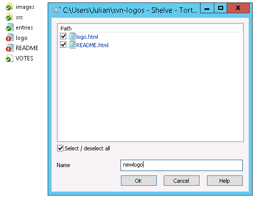
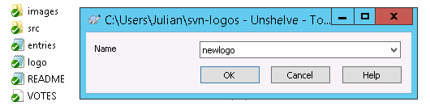
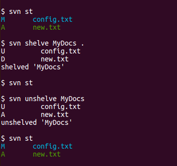

# ECVC-SVN
The hub for Assembla's [ECVC](https://www.assembla.com/ecvc) enhancements to open-source Subversion software.

## Current Project: Shelving
Shelving means setting your uncommitted changes aside, so that you can work on something else. Shelving is a fast, local,  convenient way of creating and applying patches, similar in concept to 'git stash'.

Shelving is available in preview builds of TortoiseSVN and command-line Subversion.

### Current status
This is the first public preview. It works. It only shelves text changes. See the design doc (linked below) for details.

The central development doc: [Shelving and Checkpointing Dev.](https://docs.google.com/document/d/1PVgw0BdPF7v67oxIK7B_Yjmr3p28ojabP5N1PfZTsHk) includes the rationale and the current limitations and possible extensions.
  * you can add your comments in there too

### Try Shelving...
Go to https://www.assembla.com/subversion to download for Windows, MacOS or Linux.

-- or --

Build from source, from the 'shelve' branch of Subversion or TortoiseSVN, following the normal build procedure of those projects.

### Shelving in TortoiseSVN
Start with a version-controlled folder or file that contains some local (uncommitted) changes. Right-click; select `TortoiseSVN->Shelve`.

Enter a name; click *OK*. Subversion makes a patch (like with the `Create Patch` command) and saves the patch into `.svn/shelves/NAME.patch` and reverts those changes from your local files. That is Shelving your local changes.

Then you can make other changes and shelve them with a different name.

You can restore the previously shelved changes back into your working files. Select `TortoiseSVN->Unshelve` and select the name of the shelved change, click *OK*, and Subversion applies the patch (like using the `Apply Patch` command) and removes the patch.

See also: [Creating and Applying Patches in TortoiseSVN](https://tortoisesvn.net/docs/nightly/TortoiseSVN_en/tsvn-dug-patch.html).
  

### Shelving on the Command Line

The command-line interface is documented in `svn shelve --help` and `svn unshelve --help`. It is described, and compared with git/hg/bzr/p4, in [Shelving-Checkpointing UI](https://docs.google.com/document/d/1Z0HZfpWRnU0ke2G7H20V0-my_egV_BY4D_aGlfvKuTk/edit#heading=h.wkc757u986cn).

## Assembla's Repositories on GitHub

### [assembla/subversion](https://github.com/assembla/subversion)
A central point for Assembla's contributions to [Apache Subversion](http://subversion.apache.org)
  * forked from a read-only [mirror repo](https://github.com/apache/subversion)
    (not automatically updated)

### [assembla/tsvn](https://github.com/assembla/tsvn)
A central point for Assembla's contributions to [TortoiseSVN](http://tortoisesvn.net)
  * imported from the [TortoiseSVN master repo](https://sourceforge.net/p/tortoisesvn/code/)
    (not automatically updated)
