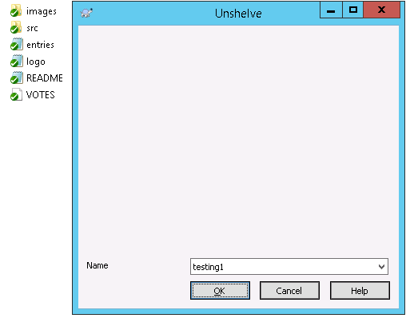

# ECVC-SVN
The hub for Assembla's [ECVC](https://www.assembla.com/ecvc) enhancements to open-source Subversion software.

## Current Project: Shelving
Shelving means setting your uncommitted changes aside, so that you can work on something else. Shelving is fast and local, like 'git stash' and 'hg shelve' (and unlike Perforce's server-side shelving).

* what it looks like: (cmdline & TSVN screen shots TBD...)
  * 
  * 
  * 
* how to try it:
  * Windows: [TortoiseSVN installer](http://example.com/TortoiseSVN-shelve.msi)
  * MacOS: [command-line Subversion package](http://example.com/subversion-shelve.pkg)
  * Linux ...
* documentation: [Shelving and Checkpointing Dev.](https://docs.google.com/document/d/1PVgw0BdPF7v67oxIK7B_Yjmr3p28ojabP5N1PfZTsHk) (in Google Docs)
* join the discussion: ...
* give your feedback: ...

## Assembla's Repositories on GitHub

### [assembla/subversion](https://github.com/assembla/subversion)
A central point for Assembla's contributions to [Apache Subversion](http://subversion.apache.org)
  * forked from a read-only [mirror repo](https://github.com/apache/subversion)
    (not automatically synchronized, so may be a little out of date)

### [assembla/tsvn](https://github.com/assembla/tsvn)
A central point for Assembla's contributions to [TortoiseSVN](http://tortoisesvn.net)
  * imported from the [TortoiseSVN master repo](https://sourceforge.net/p/tortoisesvn/code/)
    (not automatically synchronized, so may be a little out of date)
